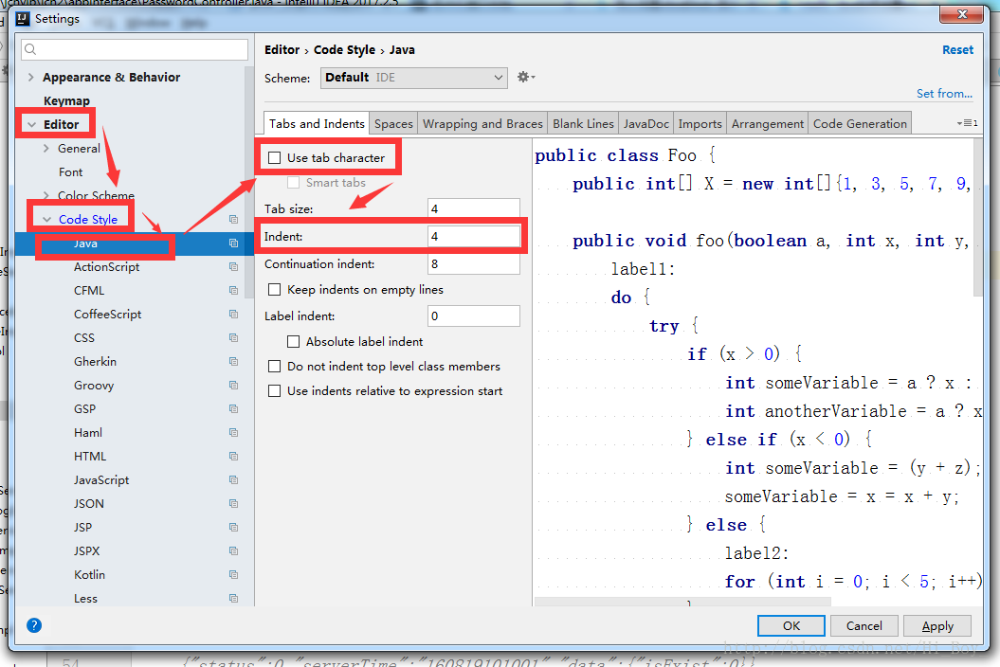

# 命名风格

### 1. 禁止下划线或者美元符号开始，也不能下划线或者美元符号结束


```java
//反例
int _name,$name,name_,name$;
```

### 2.代码中严禁使用拼音与英文混合。即使纯拼音命名也要避免采用。

```java
//正例：国际通用的名称，城市名称
String taobao,youku,hangzhou;
//反例
String bangDingCamera;//绑定摄像头
```

### 3.类名：使用UpperCamelCase风格，如：BookTool；不过对于已经缩写后的单词，则应该全部大写，如：VideoForNBA

```java
//正例：
Class CameraRecord;//大驼峰命名
Class TCPService;//TCP专有名词，大写
```

### 4.方法名、参数名、成员变量、局部变量：都统一使用lowerCamelCase风格。

```java
//正例：
String loginName;  //小驼峰命名
private void  getUserInformation(String userName,int userAge);//小驼峰命名
```

### 5.常量名：全部大写，单词间用下划线隔开，力求语义表达完整清楚，不要嫌名字长。

```java
//正例：
private final int SHENZHEN_IP_PORT=8060;
```

### 6.抽象类：命名使用Abstract或Base开头。异常类命名使用 Exception 结尾;测试类 命名以它要测试的类的名称开始，以 Test 结尾。

### 7.类型与中括号紧挨相连来表示数组

```java
//正例：
int[] arrayDemo;
//反例：
String imageList[];
```

### 8.包名：统一使用小写，点分隔符之间有且仅有一个自然语义的英语单词。包名统一使用单数形式

```java
//正例：
com.abellstar.activity
//反例：
com.abellStar    //统一小写
com.abellstar.utils   //utils带复数
```

------

# 常量定义

### 1.不允许任何魔法值（即未经预先定义的常量）直接出现在代码中。

```java
//反例：
private makeCall(String cameraName){
    //使用魔法值拼接摄像头名称
    String callName=cameraName+"_ebemate"+"112.10.7.2:6060";
}
```

### 2.在 long 或者 Long 赋值时，数值后使用大写的 L，不能是小写的 l，小写容易跟数字 1 混淆，造成误解。

------

# 代码风格

### 1.（AS格式化可以帮忙完成）大括号的使用约定。如果是大括号内为空，则简洁地写成{}即可，不需要换行;如果 是非空代码块则:

#### 1. 左大括号前不换行。

#### 2. 左大括号后换行。

#### 3. 右大括号前换行。

#### 4.右大括号后还有else等代码则不换行;表示终止的右大括号后必须换行。

### 2.（AS格式化可以帮忙完成）左小括号和字符之间不出现空格;同样，右小括号和字符之间也不出现空格;而左大 括号前需要空格。详见第 5 条下方正例提示。

### 3.（AS格式化可以帮忙完成）if/for/while/switch/do 等保留字与括号之间都必须加空格。

### 4.（AS格式化可以帮忙完成）任何二目、三目运算符的左右两边都需要加一个空格。

### 5.采用 4 个空格缩进，禁止使用 tab 字符。说明:如果使用 tab 缩进，必须设置 1 个 tab 为 4 个空格。IDEA 设置 tab 为 4 个空格时， 请勿勾选Use tab character;而在 eclipse 中，必须勾选insert spaces for tabs。以Android Studio 设置为例：

